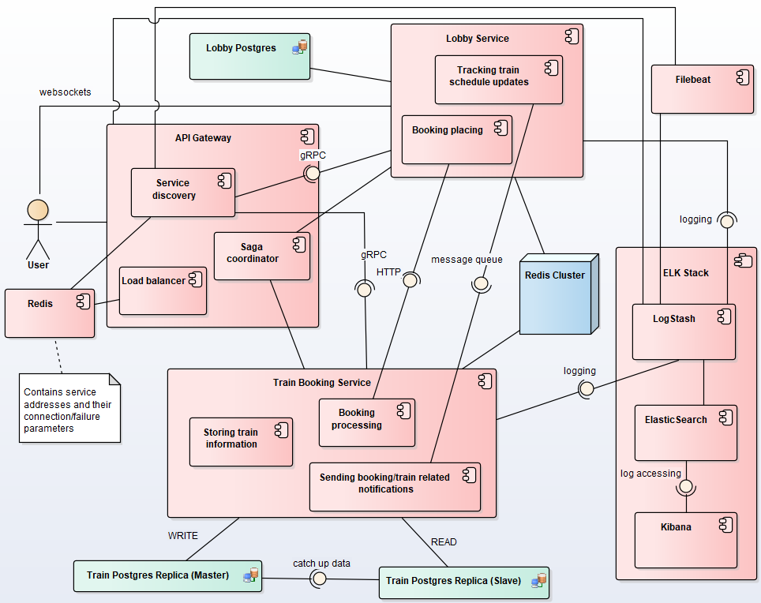

# Train Booking System (microservice-based)
Distributed system for booking train tickets and tracking their schedule.

## Application Suitability
* **Microservice architecture** is a design approach where a software application is divided into small, independent services that communicate with each other over a network. Each service focuses on a specific functionality and can be developed, deployed, and scaled independently. 
* Regarding the suitability of this architecture for the train booking system:

    1. During peak travel times or high demand periods, you can scale the Booking Service independently by adding more instances. This ensures that the system can handle a high volume of ticket purchase requests without affecting other services.

    2. Different teams can work on the Lobby Management service to enhance real-time chat features or improve user interfaces, while another team can focus on updating or optimizing the Train Information service. These updates can be deployed independently without impacting the overall platform.

* Real world example: Amtrak, the U.S. passenger rail service, uses microservices to handle real-time train bookings, seat reservations, and cancellations. Each feature, such as train availability and user booking history, can be handled by separate services. The lobby-like functionality in Amtrak includes train selection and seat reservation, much like in the proposed system, where users interact with the lobby to select trains before finalizing bookings.

## Service Boundaries

* Lobby service is responsible for user communication, managing train-related user lobbies and initiating booking requests.
* Booking service handles booking requests (delegated by the lobby service), provides users with the real-time updates via the lobby service and manages train-related data, directly requested by users.

## Technology Stack and Communication Patterns
* Lobby Service: **FastAPI + websockets** + **PostgreSQL** + **Redis** (Caching)
* Booking Service: **FastAPI** + **PostgreSQL** + **Redis** (Caching)
* API Gateway + Service Discovery: **Express**
* User-service communication: **RESTful API**
* Inter-service communication: **HTTP** + **RabbitMQ**

Regarding inter-service communication: those requests which will be directed from the lobby service to the booking service will be performed via **HTTP** (ticket booking request). On the other hand, real-time notification processing (booking confirmation) will be executed via an asynchronous message queue (**RabbitMQ**). **ServiceDiscovery**, on the other hand, is going to receive **gRPC** requests from the services in order to register them.

## Data Management Design
As it was mentioned earlier each of the two services will have its own database (shared among their instances). **Lobby Service** will be using MongoDB cloud solution and **Booking Service** will rely on the local Postgres database.
* **Lobby Service Endpoints**:

    * `GET /status`

        **Response**:
        ```
        {
            "status": "OK", 
            "message": "Lobby service is running"
        }
        ```

    * `POST /lobbies`

        **Request**: 
        ```
        { 
            "train_id": 1 
        }
        ```

        **Response**: 
        ```
        1
        ```
    
    * `GET /lobbies`

        **Response**: 
        ```
        [
            {  
                "train_id": 1,
                "id": 1
            }
        ]
        ```
    
    * `GET /lobbies/{lobby_id}`

        **Response**: 
        ```
        {  
            "train_id": 1,
            "id": 1
        }
        ```

    * `DELETE /lobbies/{lobbyId}`

        **Response**: 
        ```
        1
        ```

    * `POST /start-booking`
    
        **Request**: 
        ```
        {
            "train_id": 1,
            "user_credentials": "Tom Ford"
        }
        ```
        
        **Response**: 
        ```
        {
            "message": "Booking registered successfully", 
            "booking_id": response.content
        }
        ```

    * `ws://{lobby_service_address}/lobbies/ws/{lobby_id}`

* **Train Booking Service Endpoints**:

    * `GET /status`

        **Response**:
        ```
        {
            "status": "OK", 
            "message": "Train booking service is running"
        }
        ```

    * `POST /trains`

        **Request**: 
        ```
        { 
            "route": "Chisinau-Bucuresti",
            "departure_time": "2024-09-25T06:30",
            "arrival_time": "2024-09-26T11:40",
            "available_seats": 100 
        }
        ```

        **Response**: 
        ```
        1
        ```

    * `GET /trains`

        **Response**:
        ```
        [
            {
                "route": "Chisinau-Bucuresti",
                "departure_time": "2024-09-25T06:30",
                "arrival_time": "2024-09-26T11:40",
                "available_seats": 100,
                "id": 1
            }
        ]
        ```

    * `GET /trains/{trainId}`

        **Response**:
        ```
        {  
            "route": "Chisinau-Bucuresti",
            "departure_time": "2024-09-25T06:30",
            "arrival_time": "2024-09-26T11:40",
            "available_seats": 100,
            "id": 1
        }
        ```

    * `PUT /trains/{train_id}`

        **Request**: 
        ```
        { 
            "route": "Chisinau-Bucuresti",
            "available_seats": 100 
        }
        ```

        **Response**: 
        ```
        1
        ```

    * `DELETE /trains/{train_id}`

        **Response**: 
        ```
        1
        ```
    
    * `POST /bookings`

        **Request**: 
        ```
        {
            "train_id": 1,
            "user_credentials": "Tom Ford"
        }
        ```

        **Response**: 
        ```
        1
        ```

    * `GET /bookings`

        **Response**:
        ```
        [
            {
                "train_id": 1,
                "user_credentials": "Tom Ford",
                "id": 1
            }
        ]
        ```

    * `GET /bookings/{booking_id}`

        **Response**:
        ```
        {
            "train_id": 1,
            "user_credentials": "Tom Ford",
            "id": 1
        }
        ```

    * `PUT /bookings/{booking_id}`

        **Request**: 
        ```
        { 
            "user_credentials": "Jo Malone",
        }
        ```

        **Response**: 
        ```
        1
        ```

    * `DELETE /bookings/{booking_id}`

        **Response**: 
        ```
        1
        ```
    

## Deployment and Scaling
* Both of my services will be deployed as **Docker containers** in a common network (they will be managed using `docker compose` approach). The same principle will be applied for **Redis** cache and service discovery storage, and **Postgres** database, plus the gateway will be an additional **Express** container. There will be no need for lobby database containerization, as **Mongodb** is available as a cloud solution.
* Moreover, in order for the message queue communication to be possible, **RabbitMQ** will also be running in a separate container.
* In the conditions of deploying the whole solution using locally running containers **horizontal scaling** seems to be the most appropriate. It is much simplier to increase the number of service instances running than to increase the computational resources of the machine which runs the system.
